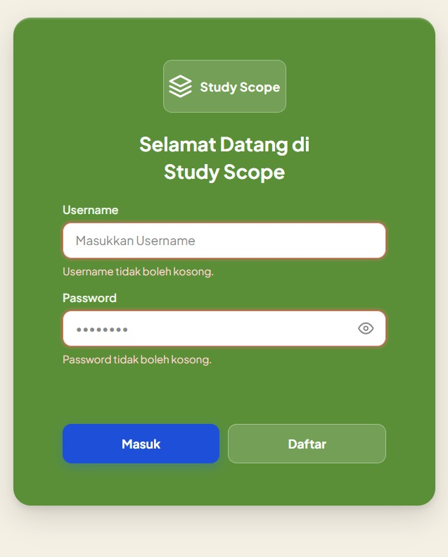
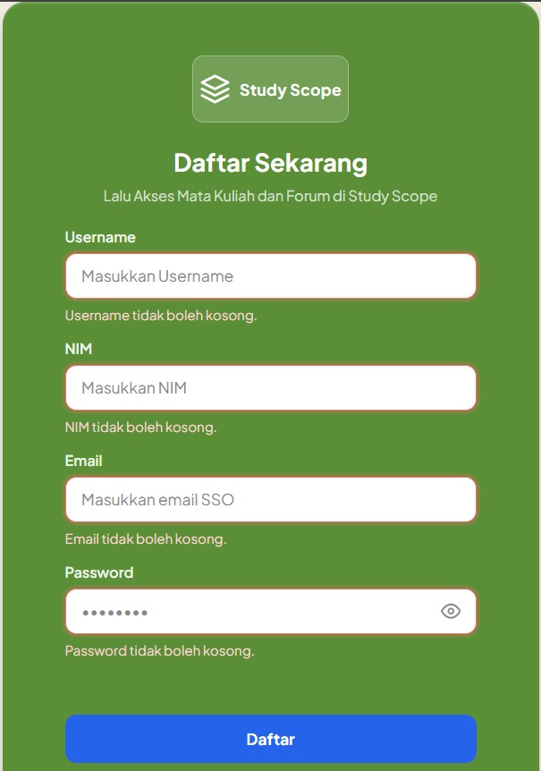
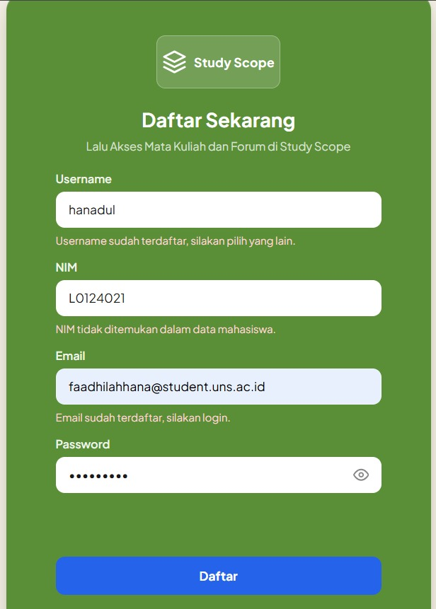
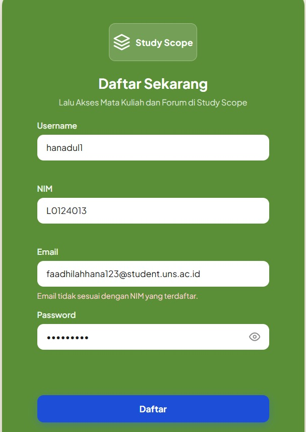
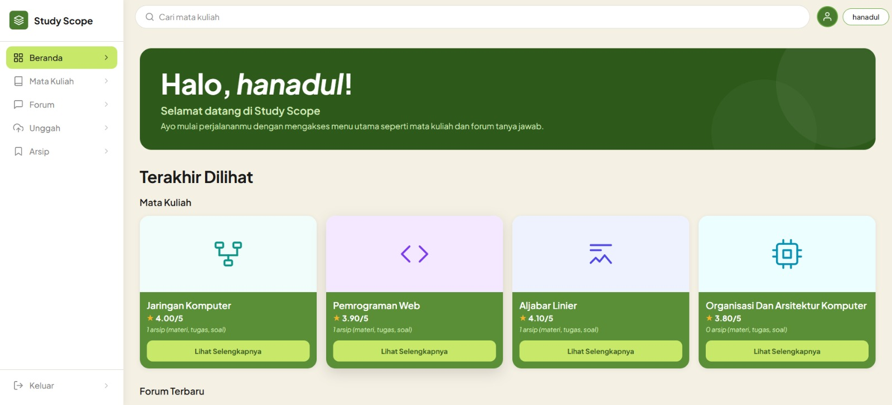
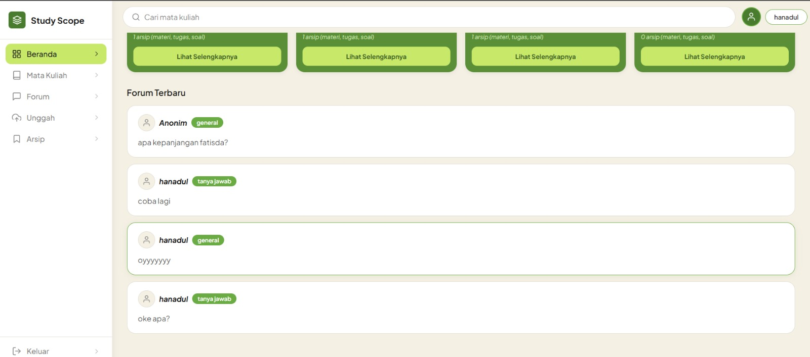
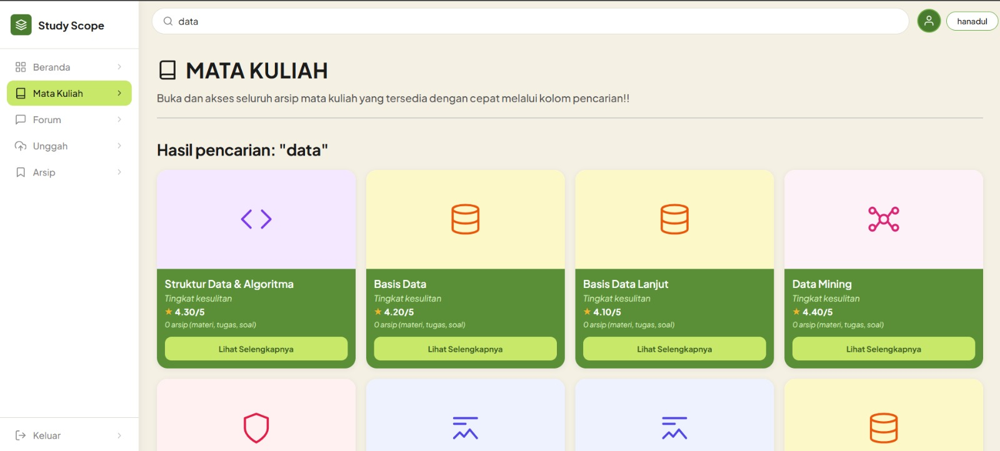

# Study Scope - Praktikum RPL

Platform akademik mahasiswa FATISDA untuk mengakses, berdiskusi, dan berbagi dokumen perkuliahan secara terpusat. 

---

## Anggota Kelompok

| Nama | NIM |
|------|-----|
| Anisa Devina Maharani | L0124002 |
| Faadhilah Hana Gustie Fatimah | L0124012 |
| Haliza Hana Maulina | L0124017 |
| Jelita Kustyara Nanda Safitri | L0124020 |

---

## Tech Stack

- **Backend:** Laravel 11 (PHP)
- **Frontend Web:** Vanilla JS + CSS (tanpa framework)
- **Database:** MySQL
- **Auth:** Laravel Session (web) & Laravel Sanctum (API mobile)

---

## Fitur yang Tersedia Saat Ini

### Mahasiswa
- **Autentikasi** - Register dan login berbasis sesi, dengan validasi NIM dan email institusi
- **Beranda** - Menampilkan mata kuliah terakhir diakses dan topik forum terbaru
- **Mata Kuliah** - Daftar semua mata kuliah dengan pencarian dan pagination
- **Detail Mata Kuliah** - Halaman detail menampilkan arsip dokumen per mata kuliah beserta tingkat kesulitan
- **Forum** - Sebuah forum untuk mengajukan pertanyaan antar pengguna
- **Unggah** - Pengguna dapat menggunggah arsip materi, tugas, dan soal

### Admin (Mahasiswa dengan akses lebih)
- **Review Dokumen** - Pengecekan unggahan pengguna sebelum dipublikasikan pada web

---

## MVP Status (3 Fitur Inti)
| No | Fitur | Kategori | Status | Screenshoot |
|:---:|---|:---:|---|:---:|
| 1 | Autentikasi (Login & Register) | Must Have | Fitur telah berjalan dengan baik dan telah sesuai dengan acceptance criteria. Pembatasan akses divalidasi pada halaman register, dimana hanya pengguna yang memiliki NIM tertentu yang dapat membuat akun dan masuk ke dalam website. Selain itu juga terdapat validasi tambahan yang tidak terdapat di kriteria yaitu berupa NIM dan email student harus serasi dengan yang ada di database mahasiswa FATISDA. Validasi ini sebenarnya bersifat opsional tetapi ini digunakan agar akses benar benar ditujukan kepada mahasiswa FATISDA. | <br><em>Halaman Login tanpa input</em><br><br><br><em>Halaman Register tanpa input</em><br><br><br><em>Halaman Register data sudah terdaftar</em><br><br><br><em>Halaman Register data tidak sesuai</em> |
| 2 | Beranda | Must Have | Fitur telah berjalan dengan baik dan telah sesuai dengan acceptance criteria. Di dashboard utama pengguna dapat melihat akses terakhir dari mata kuliah yang pernah dituju, forum yang terbaru, dan dapat mencari mata kuliah tertentu melalui search bar. Agar server tidak keberatan, akses terakhir yang diambil adalah 4 teratas dan forum terbaru yang diambil adalah 4 teratas. | <br><em>Beranda (atas) search bar, riwayat mata kuliah</em><br><br><br><em>Beranda (bawah), forum terbaru</em> |
| 3 | Menu Mata Kuliah | Must Have | Fitur telah berjalan dengan baik dan telah sesuai dengan acceptance criteria. Pengguna dapat melihat berbagai mata kuliah yang ada di FATISDA dan dapat melihat detail dari mata kuliah yang ada. List mata kuliah menggunakan pagination, agar dari sisi server tidak terlalu keberatan. Pada detail matkul, awalnya masih terdapat ketidak sesuaian tampilan pada jumlah arsip. Sehingga tim backend telah memperbaiki kesalahan tersebut. | <br><em>Daftar Mata Kuliah lengkap</em> |

---

## Struktur Folder

```
praktikum-rpl-a-6/
├── docs/                          # Dokumentasi proyek
│   ├── uml/                       # Diagram UML (use case, activity, class)
│   ├── wireframe/                 # Link desain Figma
│   ├── srs.md                     # Software Requirements Specification
│   ├── erd.png                    # Entity Relationship Diagram
│   ├── data-dictionary.md
│   ├── user-stories.md
│   ├── backlog.md
│   └── team-contract.md
├── src/
│   ├── web/                       # Aplikasi web (Laravel)
│   └── aplikasi/                  # Aplikasi mobile Android (Kotlin, untuk project PAB)
└── tests/                         # Folder pengujian
```

---

## Instalasi dan Cara Menjalankan (Aplikasi Web)

### 1. Persiapan

Pastikan perangkat telah terpasang:

- **Visual Studio Code** atau editor kode lainnya.
- **Git** untuk mengunduh source code dari GitHub.
- **Laragon** atau **XAMPP** sebagai web server yang menyediakan Apache, PHP, dan MySQL.
- **Node.js** (disertai npm) untuk menjalankan Vite.
- **Composer** (jika belum tersedia pada Laragon/XAMPP) untuk mengelola dependency Laravel.

Unduh software melalui tautan berikut:

- Git : https://git-scm.com/downloads
- Laragon : https://laragon.org/download/
- XAMPP : https://www.apachefriends.org/
- Node.js : https://nodejs.org/
- Composer : https://getcomposer.org/download/

Repository GitHub:

```text
https://github.com/anisadevina/praktikum-rpl-a-6
```

---

### 2. Menjalankan Web Server

Aktifkan Apache dan MySQL sebelum menjalankan aplikasi.

**Laragon**

- Buka aplikasi Laragon.
- Klik **Start All**.

**XAMPP**

- Buka XAMPP Control Panel.
- Klik **Start** pada **Apache** dan **MySQL**.

---

### 3. Membuat Database

Buat database baru pada MySQL, misalnya `study_scope`.

**Laragon**

- Database → Open → HeidiSQL.
- Klik kanan pada daftar database → **Create New** → beri nama database.

**XAMPP**

- Buka browser dan akses `http://localhost/phpmyadmin`.
- Klik **New**.
- Masukkan nama database, kemudian klik **Create**.

> **Catatan:** Nama database dapat disesuaikan. Pastikan sama dengan nilai `DB_DATABASE` pada file `.env`.

---

### 4. Clone Repository

Buka **Command Prompt**, **PowerShell**, **Git Bash**, atau **Terminal**, kemudian jalankan:

```bash
git clone https://github.com/anisadevina/praktikum-rpl-a-6.git
cd praktikum-rpl-a-6/src/web
```

---

### 5. Install Dependency

Install dependency backend menggunakan Composer.

```bash
composer install
```

Install dependency frontend menggunakan npm.

```bash
npm install
```

---

### 6. Membuat File Environment

Salin file konfigurasi Laravel.

**Windows**

```bash
copy env.example .env
```

**Linux/macOS**

```bash
cp env.example .env
```

---

### 7. Generate Application Key

```bash
php artisan key:generate
```

---

### 8. Konfigurasi Database

Buka file `.env`, kemudian sesuaikan konfigurasi berikut.

```env
DB_CONNECTION=mysql
DB_HOST=127.0.0.1
DB_PORT=3306
DB_DATABASE=study_scope
DB_USERNAME=root
DB_PASSWORD=
```

---

### 9. Menjalankan Migration dan Seeder

```bash
php artisan migrate --seed
```

Perintah ini akan membuat seluruh tabel database beserta data awal yang diperlukan.

---

### 10. Membuat Storage Link

```bash
php artisan storage:link
```

Perintah ini diperlukan agar dokumen yang diunggah dapat diakses melalui browser.

---

### 11. Menjalankan Aplikasi

Jalankan server Laravel.

```bash
php artisan serve
```

Pada terminal lain, jalankan Vite.

```bash
npm run dev
```

Buka browser dan akses:

```text
http://127.0.0.1:8000
```

---

## Dokumentasi

Seluruh dokumentasi proyek tersedia pada folder **docs**, meliputi:

- Software Requirements Specification (SRS)
- UML Diagram
- Wireframe
- ERD
- Data Dictionary
- Product Backlog
- User Stories
- Team Contract
- AI Usage Log
